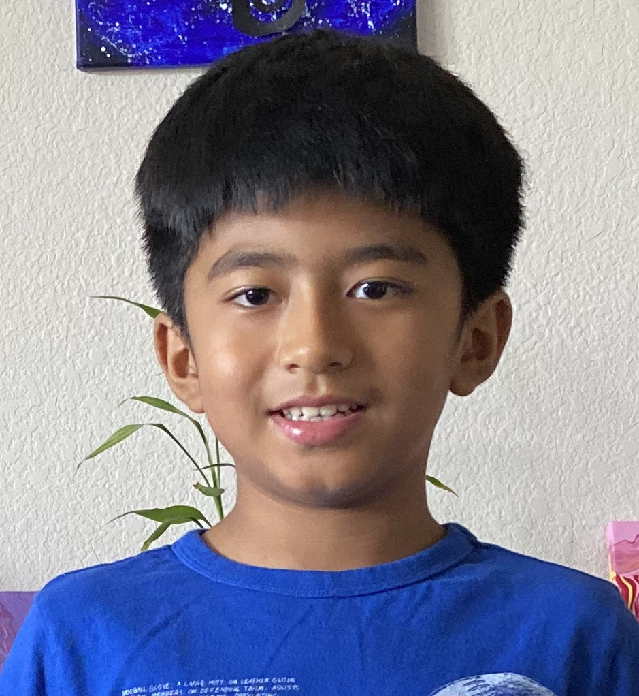

## Welcome to GitHub Page of Rocking Rover

This is a repository of EV3 Misson Program for our **_FIRST_ LEGO LEAGUE** Challenge.

Each participant should create a [GitHub](https://github.com) account. Once the account is created let your Lead Coach/Mentor-1 (Dr. Amit Dongol) know. Lead Coach/Mentor-1 will then send you invitation to collaborate in the repository. Each branch will be created for each participant. Each participant must work in their respective branch only.

In the Mean time, also download [Fork](https://fork.dev) in your computer. Lead Coach/Mentor-1 will help you set up your fork and GitHub account.

### Our Team members:

<table class="image">
<tr>
  <td></td>
  <td></td>
  <td></td>
  <td></td>
</tr>
<tr>
  <td class="caption" align="center">Avek Dongol</td>
  <td class="caption" align="center">Aarjit Adhikari</td>
  <td class="caption" align="center">Nidhi Pokhrel</td>
  <td class="caption" align="center">Alisha Bandhari</td>
</tr>
<tr>
  <td></td>
  <td></td>
  <td></td>
  <td></td>
</tr>
<tr>
  <td class="caption" align="center">Luniva Karmacharya</td>
  <td class="caption" align="center">Niket Dhakal</td>
  <td class="caption" align="center">Ian Manandhar</td>
  <td class="caption" align="center">Prajna Parajuli</td>
</tr>
</table>
